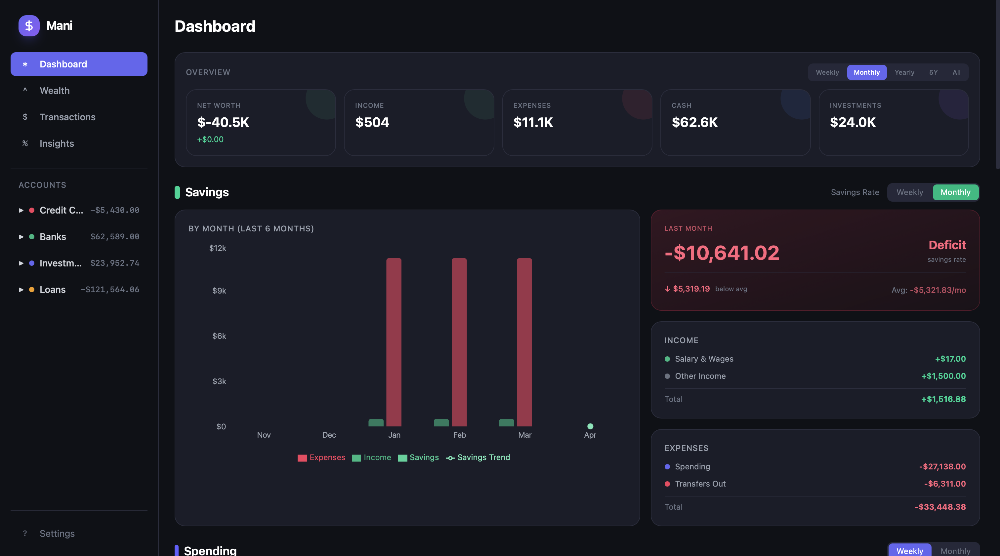
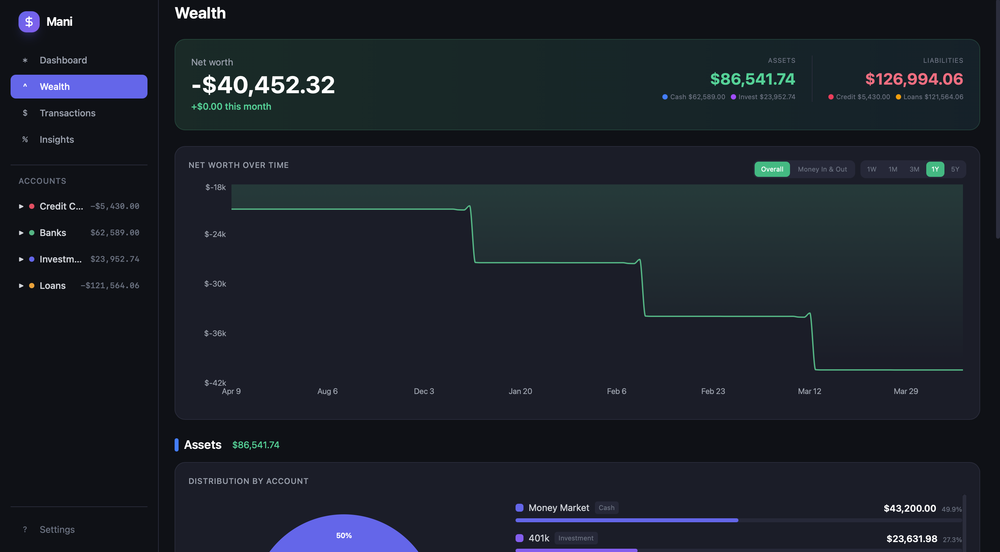
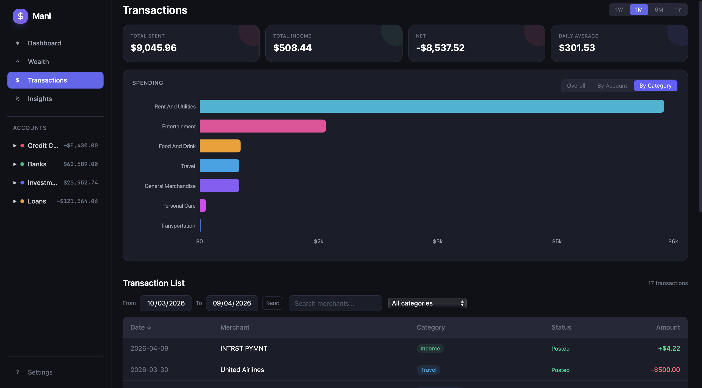
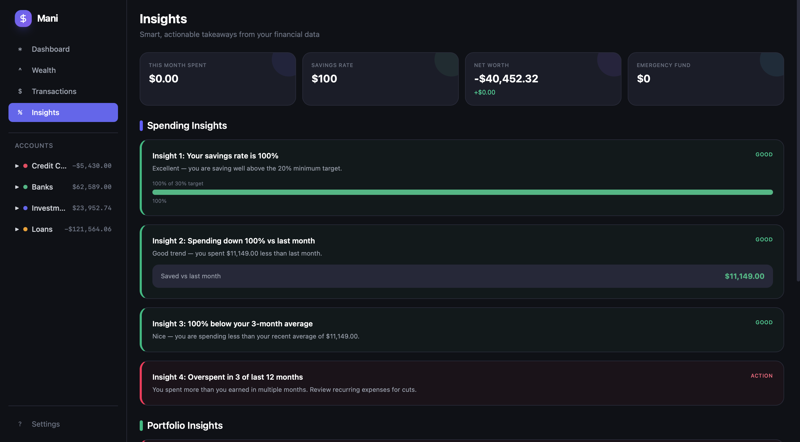

# Mani - Personal Finance Tracker

A comprehensive personal finance dashboard that connects to your real bank accounts via Plaid, providing rich visualizations, spending insights, investment tracking, and net worth analysis.

## Screenshots

| Dashboard | Wealth |
|-----------|--------|
|  |  |

| Transactions | Insights |
|-------------|----------|
|  |  |

## Features

- **Dashboard** - Savings tracking, spending analysis, investment portfolio, cash balance forecast
- **Wealth** - Net worth over time, asset distribution, liabilities breakdown
- **Transactions** - Spending charts, category/account breakdowns, recategorization
- **Insights** - Smart spending and portfolio analysis with actionable advice
- **Free Mode** - Balance-only dashboard at $0/month using free Plaid APIs
- **Dark theme** with vibrant chart colors

## Tech Stack

React 19 + TypeScript + Vite + Tailwind CSS v4 + Recharts + Supabase + Plaid

## Getting Started

### Prerequisites

You need 3 things before running setup. All are free.

#### 1. Install Node.js
Download from [nodejs.org](https://nodejs.org) (v18+). Verify: `node -v`

#### 2. Create a Supabase Project (free)
Supabase is the database backend. Takes ~2 minutes.

1. Go to [supabase.com](https://supabase.com) → Sign up (free)
2. Click **New Project** → pick a name, set a DB password, choose a region
3. Wait ~1 minute for it to provision
4. Get your credentials (you'll paste these into the setup script):

| What | Where to find it |
|------|-----------------|
| **Project URL** | Project Settings → API → Project URL (`https://xxx.supabase.co`) |
| **Anon Key** | Project Settings → API → `anon` `public` key (starts with `eyJ...`) |
| **Access Token** | [supabase.com/dashboard/account/tokens](https://supabase.com/dashboard/account/tokens) → Generate New Token |

#### 3. Create a Plaid Account (free)
Plaid connects to your bank accounts. Takes ~1 minute.

1. Go to [dashboard.plaid.com](https://dashboard.plaid.com) → Sign up
2. Get your credentials:

| What | Where to find it |
|------|-----------------|
| **Client ID** | Team Settings → Keys → client_id |
| **Secret** | Team Settings → Keys → Sandbox secret (for testing) or Production secret (for real banks) |

> **Note:** Sandbox uses fake test data (free, unlimited). Production uses real bank data (free for 200 API calls, then ~$0.30/account/month). You can start with Sandbox and switch later.

### Setup (one command)

```bash
git clone https://github.com/pmr99/mani.git
cd mani
chmod +x setup.sh && ./setup.sh
```

The script handles everything interactively:
- ✅ Installs npm dependencies
- ✅ Creates `.env` with your Supabase credentials
- ✅ Runs all 5 database migrations via Supabase API
- ✅ Deploys all edge functions
- ✅ Configures Plaid secrets in Supabase

### Run

```bash
npm run dev
```

Open [localhost:5173](http://localhost:5173), click **+ Link Account** in the sidebar, and connect your bank.

> **Sandbox testing:** use `user_good` / `pass_good` as credentials.

## Free Mode vs Full Mode

Mani auto-detects your mode. If you've synced transactions before, it defaults to Full (you're already paying per-account/month — unlimited syncs are free). New users start in Free Mode.

| | Free Mode | Full Mode |
|---|---|---|
| **Cost** | **$0/month** | ~$0.30-0.50/account/month |
| **Balances & Net Worth** | ✅ | ✅ |
| **Asset Distribution** | ✅ | ✅ |
| **Transaction History** | ❌ | ✅ |
| **Spending Analysis** | ❌ | ✅ |
| **Investment Holdings** | ❌ | ✅ |

Toggle between modes in the sidebar. Plaid charges per connected account per month (not per API call), so once active, syncing is unlimited.

## Plaid Pricing

| API | Cost | Used For |
|-----|------|----------|
| `/accounts/get` | **Free, unlimited** | Balances, net worth (Free Mode) |
| Transactions | $0.30/account/month | Spending analysis (Full Mode) |
| Investments Holdings | $0.18/account/month | Portfolio detail (Full Mode) |
| Investments Transactions | $0.35/account/month | Portfolio history (Full Mode) |

## License

MIT
